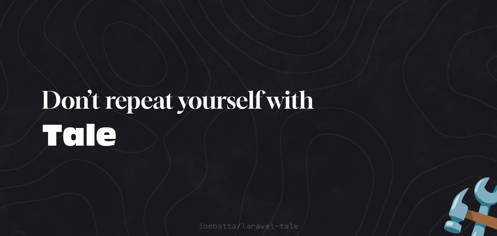

# Tale

As a developer, I found myself repeating the same steps over and over when setting up Laravel projects. This involved
creating files, tweaking configurations, and creating utility classes. To save time and effort, I created Tale - a
collection of commonly used tools and utilities that I often use, all in one package.

## Getting Started

**1. Install Tale**

```shell
composer require joebatta/tale
```

## Docs
**Soon**
